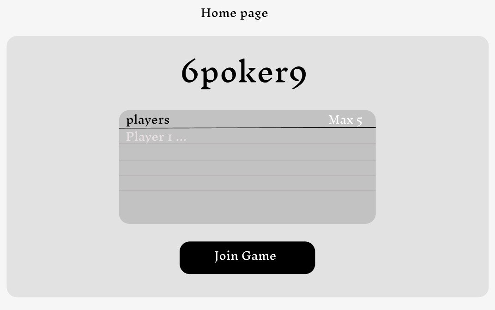
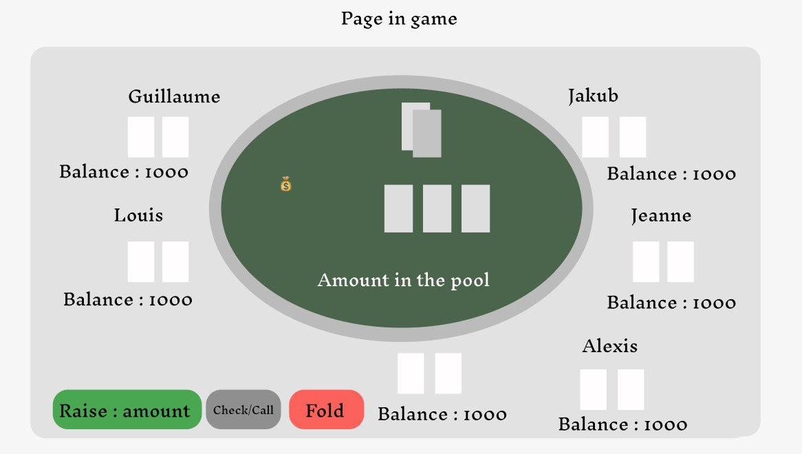

# Team 69

## Team members

```
 - Bassier Jeanne Louise - 378371, jeanne.bassier@epfl.ch
 - Grillet-Aubert Alexis Théo André - 381587, alexis.grillet-aubert@epfl.ch
 - Kliment Jakub - 380660, jakub.kliment@epfl.ch
 - Lepin Guillaume Marie - 381189, guillaume.lepin@epfl.ch
```

## Proposal

### User stories

As a player, I want to join a poker game when it starts, so that I can compete against other players.
As a player, when it's my turn, I want to select my action (check/call, bet, fold), so I can influence the outcome of the game.
As a player, after each round, I want to see the updated scores based on the outcome of a round to plan my strategy.
As a player, I want to play until there is a winner of the game.

### Requirements

The app will implement a simplified multiplayer poker game as a state-driven system for up to five players. Players begin in the initial state, selecting usernames. Once all players have joined the game, the state transitions to the start of the game, initializing the deck, distributing cards to each player, and assigning the first turn. The game then progresses through betting rounds interspersed with transitions to reveal community cards (flop, turn, river), ending in a showdown state to determine the winner.

Each state defines allowable actions: in the betting states, players can check, raise, call, or fold. The server validates actions based on the game rules and updates the state accordingly (e.g., advancing turns, adjusting chip counts, or moving to the next phase). Invalid actions return alerts to the client, ensuring game integrity. States such as "waiting for players" or "game over" also enforce clear transitions to guide the game flow.

The client communicates with the server, sending player actions and receiving real-time updates on the game state. The server maintains authoritative state, including the deck, player hands, community cards, and current bets. Views on the client dynamically render state data, showing the player's hand, community cards, pot size, and current turn. Game events (e.g., a player folding or the flop being dealt) trigger updates to all clients.

The UI reflects the game state, presenting action buttons only for valid moves in the current phase. Turn indicators and chip counts are updated live, ensuring clarity. The server handles transitions like moving from betting to the next card reveal, resolving the winner during showdowns, and notifying players when the game ends.

With this design, the game ensures smooth transitions between states, clear separation of logic on the server, and an intuitive interface for players. All interactions are validated server-side to maintain fairness while minimizing client-side complexity.

### Roles

Jeanne will manage the UI and all user interactions. Alexis' job will be to implement the encoding and decoding to connect the UI with the logic of the game. Guillaume will implement the logic and the rules of the game. Jakub will manage the states and state transitions on the server side. Finally, tests will be separated evenly across all team members.

### Mock-ups


